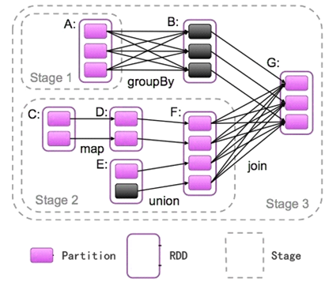

# 依赖
>RDD 的容错机制是通过记录更新来实现的，且记录的是粗粒度的转换操作。在外部，我们将记录的信息称为血统 **（Lineage）** 关系，底层实现上，Apache Spark 记录的则是 RDD 之间的依赖 **（Dependency）** 关系。在一次转换操作中，创建得到的新 RDD 称为子 RDD，提供数据的 RDD 称为父 RDD，父 RDD 可能会存在多个，我们把子 RDD 与父 RDD 之间的关系称为依赖关系。

依赖只保存父 RDD 信息，转换操作的其他信息，如数据处理函数，会在创建 RDD 时候，保存在新的 RDD 内。依赖在 Apache Spark 源码中的对应实现是 Dependency 抽象类。

```
/**
 * :: DeveloperApi ::
 * Base class for dependencies.
 */
@DeveloperApi
abstract class Dependency[T] extends Serializable {
  def rdd: RDD[T]
}
```

每个 Dependency 子类内部都会存储一个 RDD 对象，对应一个父 RDD，如果一次转换转换操作有多个父 RDD，就会对应产生多个 Dependency 对象，所有的 Dependency 对象存储在子 RDD 内部，通过遍历 RDD 内部的 Dependency 对象，就能获取该 RDD 所有依赖的父 RDD。

## 依赖分类
Apache Spark 将依赖进一步分为两类，分别是窄依赖（Narrow Dependency）和 Shuffle 依赖（Shuffle Dependency，在部分文献中也被称为 Wide Dependency，即宽依赖）。

### 窄依赖
窄依赖中，父 RDD 中的一个分区最多只会被子 RDD 中的一个分区使用，换句话说，父 RDD 中，一个分区内的数据是不能被分割的，必须整个交付给子 RDD 中的一个分区。下图展示了几类常见的窄依赖及其对应的转换操作。


窄依赖的实现在 NarrowDependency 抽象类中。
```
/**
 * :: DeveloperApi ::
 * Base class for dependencies where each partition of the child RDD depends on a small number
 * of partitions of the parent RDD. Narrow dependencies allow for pipelined execution.
 */
@DeveloperApi
abstract class NarrowDependency[T](_rdd: RDD[T]) extends Dependency[T] {
  /**
   * Get the parent partitions for a child partition.
   * @param partitionId a partition of the child RDD
   * @return the partitions of the parent RDD that the child partition depends upon
   */
  def getParents(partitionId: Int): Seq[Int]

  override def rdd: RDD[T] = _rdd
}
```

NarrowDependency 要求子类实现 getParent 方法，用于获取一个分区数据来源于父 RDD 中的哪些分区（虽然要求返回 Seq[Int]，实际上却只有一个元素）。

窄依赖可以进一步被分为两类
#### 一对一依赖OneToOneDependency
一对一依赖表示子 RDD 分区的编号与父 RDD 分区的编号完全一致的情况，若两个 RDD 之间存在着一对一依赖，则子 RDD 的分区个数、分区内记录的个数都将继承自父 RDD。
```
/**
 * :: DeveloperApi ::
 * Represents a one-to-one dependency between partitions of the parent and child RDDs.
 */
@DeveloperApi
class OneToOneDependency[T](rdd: RDD[T]) extends NarrowDependency[T](rdd) {
  override def getParents(partitionId: Int) = List(partitionId)
}
```

#### 范围依赖RangeDependency
它仅仅被org.apache.spark.rdd.UnionRDD使用。UnionRDD是把多个RDD合成一个RDD，这些RDD是被拼接而成，即每个parent RDD的Partition的相对顺序不会变，只不过每个parent RDD在UnionRDD中的Partition的起始位置不同。因此它的getPartents如下。

```
/**
 * :: DeveloperApi ::
 * Represents a one-to-one dependency between ranges of partitions in the parent and child RDDs.
 * @param rdd the parent RDD
 * @param inStart the start of the range in the parent RDD
 * @param outStart the start of the range in the child RDD
 * @param length the length of the range
 */
@DeveloperApi
  class RangeDependency[T](rdd: RDD[T], inStart: Int, outStart: Int, length: Int)
  extends NarrowDependency[T](rdd) {

  override def getParents(partitionId: Int) = {
    if (partitionId >= outStart && partitionId < outStart + length) {
      List(partitionId - outStart + inStart)
    } else {
      Nil
    }
  }
}
```

**注：图中的outStart标的可能有点问题，但是计算是正确的**

### 宽依赖（Shuffle 依赖）
Shuffle 依赖中，父 RDD 中的分区可能会被多个子 RDD 分区使用。因为父 RDD 中一个分区内的数据会被分割，发送给子 RDD 的所有分区，因此 Shuffle 依赖也意味着父 RDD 与子 RDD 之间存在着 Shuffle 过程。下图展示了几类常见的Shuffle依赖及其对应的转换操作。


Shuffle 依赖的对应实现为 ShuffleDependency 类，其源码如下。
```
/**
 * :: DeveloperApi ::
 * Represents a dependency on the output of a shuffle stage. Note that in the case of shuffle,
 * the RDD is transient since we don't need it on the executor side.
 *
 * @param _rdd the parent RDD
 * @param partitioner partitioner used to partition the shuffle output
 * @param serializer [[org.apache.spark.serializer.Serializer Serializer]] to use. If set to None,
 *                   the default serializer, as specified by `spark.serializer` config option, will
 *                   be used.
 */
@DeveloperApi
class ShuffleDependency[K, V, C](
    @transient _rdd: RDD[_ <: Product2[K, V]],
    val partitioner: Partitioner,
    val serializer: Option[Serializer] = None,
    val keyOrdering: Option[Ordering[K]] = None,
    val aggregator: Option[Aggregator[K, V, C]] = None,
    val mapSideCombine: Boolean = false)
  extends Dependency[Product2[K, V]] {

  override def rdd = _rdd.asInstanceOf[RDD[Product2[K, V]]]

  //获取新的shuffleId
  val shuffleId: Int = _rdd.context.newShuffleId()
  
  //向ShuffleManager注册Shuffle的信息
  val shuffleHandle: ShuffleHandle = _rdd.context.env.shuffleManager.registerShuffle(
      shuffleId, _rdd.partitions.size, this)

  _rdd.sparkContext.cleaner.foreach(_.registerShuffleForCleanup(this))
}
```
类中几个成员的作用如下：
- rdd：用于表示 Shuffle 依赖中，子 RDD 所依赖的父 RDD。
- shuffleId：Shuffle 的 ID 编号，在一个 Spark 应用程序中，每个 Shuffle 的编号都是唯一的。
- shuffleHandle：Shuffle 句柄，ShuffleHandle 内部一般包含 Shuffle ID、Mapper 的个数以及对应的 Shuffle 依赖，在执行 ShuffleMapTask 时候，任务可以通过 ShuffleManager 获取得到该句柄，并进一步得到 Shuffle 相关信息。
- partitioner：分区器，用于决定 Shuffle 过程中 Reducer 的个数（实际上是子 RDD 的分区个数）以及 Map 端的一条数据记录应该分配给哪一个 Reducer，也可以被用在 CoGroupedRDD 中，确定父 RDD 与子 RDD 之间的依赖关系类型。
- serializer：序列化器。用于 Shuffle 过程中 Map 端数据的序列化和 Reduce 端数据的反序列化。
- KeyOrdering：键值排序策略，用于决定子 RDD 的一个分区内，如何根据键值对 类型数据记录进行排序。
- Aggregator：聚合器，内部包含了多个聚合函数，比较重要的函数有 createCombiner：V => C，mergeValue: (C, V) => C 以及 mergeCombiners: (C, C) => C。例如，对于 groupByKey 操作，createCombiner 表示把第一个元素放入到集合中，mergeValue 表示一个元素添加到集合中，mergeCombiners 表示把两个集合进行合并。这些函数被用于 Shuffle 过程中数据的聚合。
- mapSideCombine：用于指定 Shuffle 过程中是否需要在 map 端进行 combine 操作。如果指定该值为 true，由于 combine 操作需要用到聚合器中的相关聚合函数，因此 Aggregator 不能为空，否则 Apache Spark 会抛出异常。例如：groupByKey 转换操作对应的ShuffleDependency 中，mapSideCombine = false，而 reduceByKey 转换操作中，mapSideCombine = true。

### 多依赖
依赖关系是两个 RDD 之间的依赖，因此若一次转换操作中父 RDD 有多个，则可能会同时包含窄依赖和 Shuffle 依赖，下图所示的 Join 操作，RDD a 和 RDD c 采用了相同的分区器，两个 RDD 之间是窄依赖，Rdd b 的分区器与 RDD c 不同，因此它们之间是 Shuffle 依赖，具体实现可参见 CoGroupedRDD 类的 getDependencies 方法。这里能够再次发现：一个依赖对应的是两个 RDD，而不是一次转换操作。


```
override def getDependencies: Seq[Dependency[_]] = {
    rdds.map { rdd: RDD[_ <: Product2[K, _]] =>
        if (rdd.partitioner == Some(part)) {
            /* I: Partitioner 相同，则是 OneToOneDepdencency */
            logDebug("Adding one-to-one dependency with " + rdd)
            new OneToOneDependency(rdd)
        } else {
            /* I: Partitioner 不同，则是 ShuffleDependency */
            logDebug("Adding shuffle dependency with " + rdd)
            new ShuffleDependency[K, Any, CoGroupCombiner](rdd, part, serializer)
        }
    }
}
```

## 依赖与容错机制
从失败恢复来看，窄依赖的失败恢复起来更高效，因为它只需找到父RDD的一个对应分区即可，而且可以在不同节点上并行计算做恢复；宽依赖则牵涉到父RDD的多个分区，恢复起来相对复杂些。

### Stage
Stage可以简单理解为是由一组RDD组成的可进行优化的执行计划。如果RDD的衍生关系都是窄依赖，则可放在同一个Stage中运行，若RDD的依赖关系为宽依赖，则要划分到不同的Stage。这样Spark在执行作业时，会按照Stage的划分, 生成一个完整的最优的执行计划。下面引用一张比较流行的图片辅助大家理解Stage，如图RDD-A到RDD-B和RDD-F到RDD-G均属于宽依赖，所以与前面的父RDD划分到了不同的Stage中。



[返回目录](../CONTENTS.md)