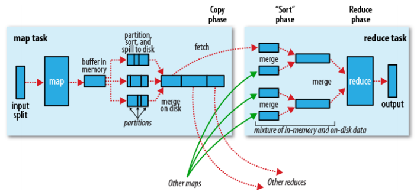
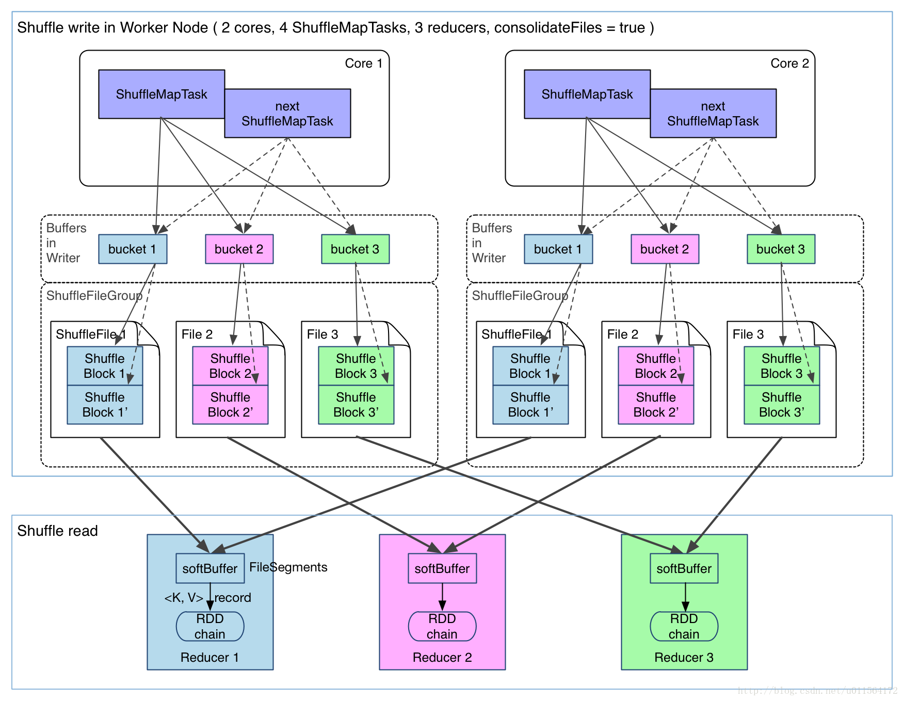

# Shuffle过程

为了符合 **子阶段需要等待父阶段执行完毕后子阶段才开始执行** 这一特性，只有当 Shuffle 依赖中父 RDD 所有分区的数据被计算和存储完毕之后，子 RDD 才会开始去拉取需要的分区数据。我们将整个数据传输的过程称为 Apache Spark 的 Shuffle 过程。Shuffle 过程中，我们把一个分区数据计算完毕到数据被写入到磁盘的过程，称为 Shuffle 写过程。对应的，在子 RDD 某个分区计算的过程中，把所需的数据从父 RDD 拉取过来的过程，称为 Shuffle 读过程。

与MapReduce类似，Shuffle 过程中，提供数据的一端，被称作 Map 端，Map 端每个生成数据的任务称为 Mapper，对应的，接收数据的一端，被称作 Reduce 端，Reduce 端每个拉取数据的任务称为 Reducer，Shuffle 过程本质上都是将 Map 端获得的数据使用分区器进行划分，并将数据发送给对应的 Reducer 的过程。

## Hadoop Shuffle

MR 模型中，每个 Mapper 维护一个环形内存缓冲区，用于存储任务输出，当内存缓冲区数据达到一定阈值时候，将缓冲区中的数据进行分区（Partition），对于同一个分区内部的数据按照键值进行排序（Sort），如果开发者指定了 Combiner，那么对于排序后的结果，还会执行一次合并(Combine）操作，最后的结果会被溢存（Spill）到磁盘文件中，在任务完成之前，Apache Hadoop 会采用多路归并算法（K-way Merge Algorithm）来归并（Merge）这几个内部有序的溢存文件，新文件中数据同样是有序的。

Reducer 需要从 Map 端拉取数据，当一个 Mapper 运行结束之后，会通知 JobTracker，Reducer 定期从 JobTracker 获取相关信息，然后从 Mapper 端获取数据，所有需要的数据复制完毕后，Reducer 会合并来自不同 Map 端拉取过来的数据，并将最后排序好的数据送往 Reduce 方法处理。

## Spark Shuffle
### 聚合器
对于 Apache Hadoop，聚合是通过对同一分区内的数据按照键值排序，键值相同的数据会彼此相邻，从而达到聚合的目的，而聚合后的数据会被交给 combine（Map 端）和 reduce（Reduce 端）函数去处理。对于 Apache Spark，聚合以及数据计算的过程，则是交付给聚合器（Aggregator）去处理。

实例化一个聚合器的时候，需要提供三个函数，分别是：`createCombiner: V => C`，`mergeValue: (C, V) => C` 以及 `mergeCombiners: (C, C) => C`。我们以单词统计程序中的 reduceByKey(_ + _) 转换操作为例，介绍这三个函数究竟是如何实现数据的聚合和计算的。
#### 聚合器实例
Spark 会使用哈希表来存储所有聚合数据的处理结果，表中的浅色空槽用于存储键值，右侧相邻深色空槽表示该键值对应的计算值。聚合器开始处理聚合数据之前，哈希表是空的，如下图所示。

假设需要聚合的数据是 <"A", 1>，<"B", 1>，<"A", 1>，需要注意，这时候数据是无序的。对于第一个数据，<"A", 1>，Apache Spark 会通过散列函数计算键值 "A" 对应的哈希表地址，假设此时得到的哈希值为 1，因此哈希表中，地址为 2 的空槽用于存放键值 "A"，地址 为 3 的空槽用于存放计算后的值。由于地址为 2 和地址为 3 的槽均为空槽，这时候会调用 createCombiner(kv._2) 函数来计算初始值。对于 reduceByKey 转换操作， createCombiner 实际为 (v: V) => v，因此得到计算值为 1，将 "A" 放入到地址为 2 的空槽中，将 1 放入到地址为 3 的插槽中。同理，对于数据 <"B", 1>，可以放入到另外两个空槽中。

第三个数据是 <"A", 1>，计算得到地址为 1，此时因为地址为 2 和 地址为 3 的插槽已经有值 oldValue，这时候调用 mergeValue(oldValue, kv._2) 来计算新的值。 对于 reduceByKey 转换操作，mergeValue 实际上为用户在调用 reduceBykey 时候指定的函数，在本例中，该函数为 _ + _，因此得到新的值 2，更新地址为 3 的槽。

reduceByKey 指定了 Combiner，因此会在 Map 端执行结合操作，Reducer 接收到的键值对数据，值的类型会是 C 而非 V（尽管在本例中，C 和 V 是相同类型），这时候如果键值对应的槽为空槽，直接插入 kc._2，否则调用 mergeCombiners(oldValue, kc._2) 函数来计算新的值。对于 reduceByKey 转换操作，mergeCombiners 实际为用户在调用 reduceBykey 时候指定的函数。

#### 优点
Spark 的聚合 - 计算过程不需要进行任何排序！！！这意味着 Apache Spark 节省了排序所消耗的大量时间，代价是最后得到的分区内部数据是无序的；再者，Apache Spark 的聚合 / 计算过程是同步进行的，聚合完毕，结果也计算出来，而 Apache Hadoop 需要等聚合完成之后，才能开始数据的计算过程；
#### 缺点
Spark 将所有的计算操作都限制在了 createCombiner、mergeValue 以及 mergeCombiners 之内，在灵活性之上显然要弱于 Apache Hadoop，例如，Apache Spark 很难通过一次聚合 - 计算过程求得平均数。

### Hash Shuffle

