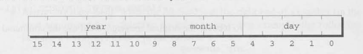

# 底层程序设计

## 位运算符
- `<<`：左移运算符，低位补0，高位溢出
- `>>`：右移运算符，无符号数和非负数高位补0，低位溢出，负数高位补1，低位溢出。
- `~`：按位取反
- `&`：按位与
- `^`：按位异或
- `|`：按位或

惯用法：
```
i |= 1 << j     // 第j位设1
i &= ~(1 << j)  // 第j位清空
i & 1 << j      // 第j位是否为1
``` 

## 结构中的位域
特殊数据类型：
```
struct file_date {
    unsigned int day: 5;
    unsigned int month: 4;
    unsigned int year: 7;
}
```



[返回目录](../CONTENTS.md)