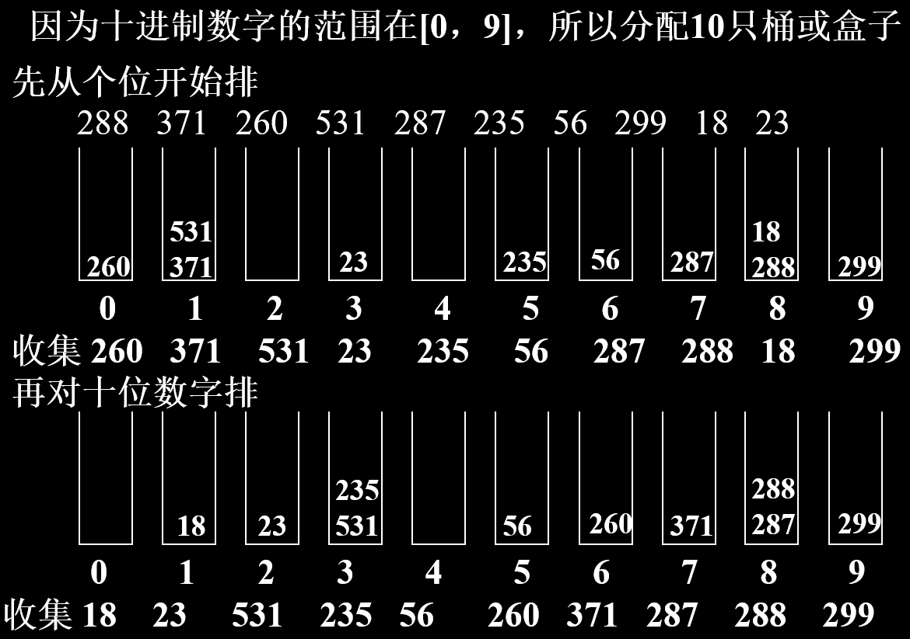
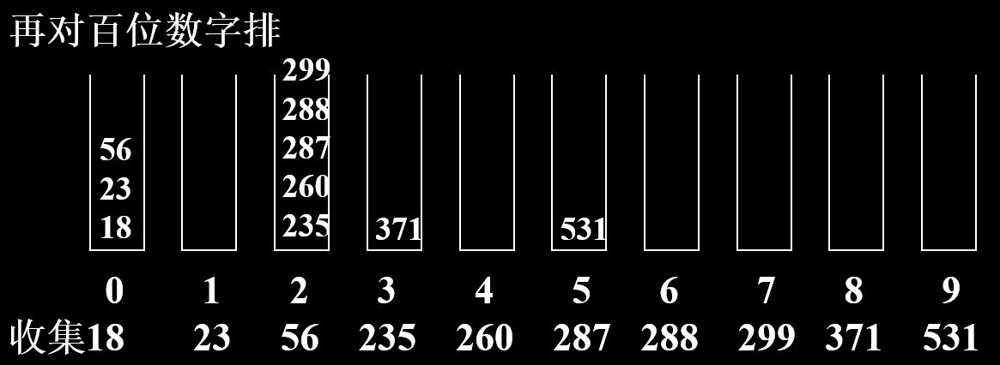

# 排序
## 插入排序
* 思想：n个对象已排好序，插入第n+1个对象到适当位置
* 方法：直接插入排序、折半插入排序、链表插入排序、希尔排序

1. 直接插入排序
```
public static void insertionSort( Comparable [] a ) {
      int j;
      for ( int p = 1; p < a.length; p++ ) {
           Comparable tmp = a[p];
           for ( j = p; j > 0 && tmp.compareTo(a[j – 1])<0; j-- )
                 a[j] = a[j – 1];
            a[j] = tmp;
       }
}
```
* 稳定性：稳定
* O（N^2）

2. 折半插入排序（二分法插入排序）
```
template <class Type> void  BinaryInsertSort( datalist<Type> &list) {
    for (int i=1; i<list.currentSize; i++)
         BinaryInsert(list, i);
}                                         
template <class Type> void  BinaryInsert( datalist<Type> &list,  int i) {
      int left=0,  Right=i-1;
      Element<Type>temp=list.Vector[i];
      while (left<=Right) {
         int middle=(left+Right)/2;
         if (temp.getkey()<list.Vector[middle].getkey())
             Right=middle-1;
         else left=middle+1;
      }
      for (int k=i-1; k>=left; k--)
         list.Vector[k+1]=list.Vector[k];
      list.Vector[left]=temp;
}
```
* 稳定性：稳定
* O（N*logN）

3. 希尔排序（缩小增量排序）
* 思路
      * 取一增量（间隔gap<n），按增量分组，对每组使用直接插入排序或其他方法排序；
      * 减少增量（分的组减少，但每组记录增多）
      * 直至增量为1，即为一个组时。
```
public static void shellsort( Comparable[] a ) {
    for (  int gap = a.length/2; gap > 0; gap /= 2 )
        for ( int i = gap; i < a.length; i++ ) {
            Comparable tmp = a[i];
            int j = i; 
            for ( ; j >= gap && tmp.compareTo(a[j-gap]) < 0; j -= gap )
                a[j] = a[j – gap];
            a[j] = tmp;
       }
}
```
* 稳定性：不稳定
* < O（n2）

## 交换排序
* 思想：不断的交换反序的对偶，直到不再有反序的对偶为止
* 方法：冒泡排序、快速排序

1. 冒泡排序
参见[Algorithm Analysis](algorithm_analysis/algorithm_analysis.md)
* 稳定性：稳定
* O（N^2）

2. 快速排序
* 方法
    * 在n个对象中，取一个对象（如第一个对象-基准pivot）
    * 按该对象的关键码把所有<=该关键码的对象分划在它的左边，>该关键码的对象分划在它的右边 
    * 对左边和右边（子序列）分别再用快排序
```
public class QuickSort {
    private static void exchange(int[] list, int i, int j) {
        int temp = list[i];
        list[i] = list[j];
        list[j] = temp;
    }
    
    private static int partition(int[] list, int low, int high) {
        int pivot = list[low];
        int leftPointer = low;
        int rightPointer = high;
        
        while(true) {
            while(list[++leftPointer] < pivot) {
                if(leftPointer == high)
                    break;
            }
            while(list[rightPointer] > pivot) {
                -- rightPointer;
                if(rightPointer == low)
                    break;
            }
            if(leftPointer >= rightPointer)
                break;
            exchange(list, leftPointer, rightPointer);
        }
        exchange(list, low, rightPointer);
        return rightPointer;
    }
    
    public static int[] quickSort(int[] unSortList, int leftSide, int rightSide) {
        if(leftSide < rightSide) {
            int pivotPosition = partition(unSortList, leftSide, rightSide);
            quickSort(unSortList, leftSide, pivotPosition - 1);
            quickSort(unSortList, pivotPosition + 1, rightSide);
        }
        return unSortList;
    }

    public static void main(String[] args) {
         int a[] = { 9, 1, 4, 3 };
     int[] result_a = quickSort(a, 0, a.length - 1);
     for(int i: result_a) {
         System.out.print(i + " ");
     }
     System.out.println();
    
     int b[] = { 9, 1, 3, 3 };
     int[] result_b = quickSort(b, 0, b.length - 1);
     for(int i: result_b) {
         System.out.print(i + " ");
     }
     System.out.println();
    }
}
```
* 稳定性：不稳定
* O（N*logN）

## 选择排序
* 方法：直接选择排序、锦标赛排序、堆排序

1. 直接选择排序
* 方法
      * 首先在n个记录中选出关键码最小（最大）的记录
      * 然后与第一个记录（最后第n个记录）交换位置
      * 再在其余的n-1个记录中选关键码最小（最大）的记录
      * 然后与第二个记录（第n-1个记录）交换位置
      * 直至选择了n－1个记录。
```
template <class Type> void SelectSort(datalist<Type> &list) {
    for ( int i=0; i<list.CurrentSize-1; i++ )
        SelectExchange(list, i);
}
template <class Type> void SelectExchange( datalist<Type> & list, const int i) {
    int k=i;
    for ( int j=i+1; j<list.CurrentSize; j++ )
         if (list.Vector[j].getkey()<list.Vector[k].getkey())
             k=j;
    if ( k!=i) Swap(list.Vactor[i], list.Vector[k]);
}
```
* 稳定性：不稳定
* O（N^2）

2. *锦标赛排序
* 方法
      * n个对象的关键码两两比较得到「n/2 」（上限）个 比较的优胜者(关键码小者)保留下来, 再对这「n/2 」（上限）个对象再进行关键码的两两比较, ……直至选出一个最小的关键码为止。
      * 输出最小关键码，再进行调整。
* 稳定性：稳定
* O（N*logN）

3. 堆排序
* 方法
      * 建堆，根据初始输入数据，利用堆的调整算法FilterDown()，形成初始堆。（形成最大堆）
      * 一系列的对象交换和重新调整堆
* 稳定性：不稳定
* O（N*logN）

## 归并排序
* 两个（多个）有序的文件组合成一个有序文件
* 方法：每次取出两个序列中的小的元素输出之；当一序列完，则输出另一序列的剩余部分
* 稳定性：稳定

## 基数排序
* 链式基数排序
* Example：288   371   260   531   287   235   56   299   18   23


* 稳定性：稳定

[返回目录](../CONTENTS.md)