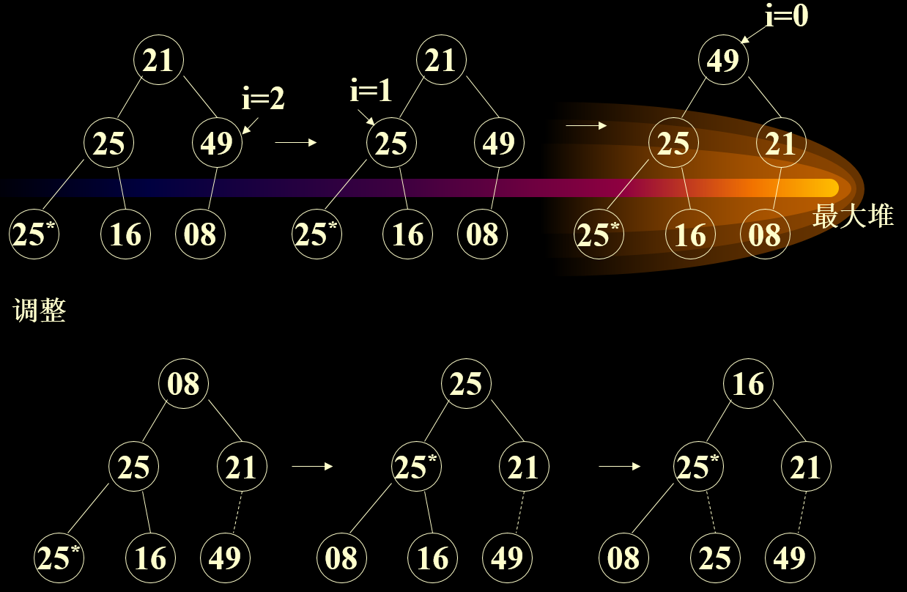
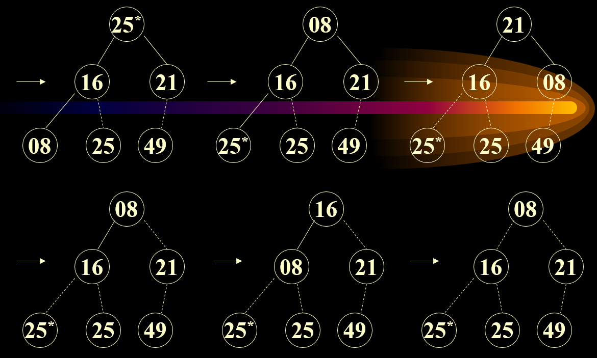

# 优先队列
## 优先队列
* 每个元素都有优先级
* 表示：线性表示、堆表示

## 优先队列的堆表示
* 如：最大堆表示

## 堆排序 heap sort
* Example：{21, 25, 49, 25*, 16, 08}


* 堆排序是不稳定的
* 代码

```
public class HeapSort {

    public static void adjust(int H[], int s, int length) {
        int temp = H[s];
        int child = 2 * s + 1;
        while (child < length) {
            if (child + 1 < length && H[child] < H[child + 1]) {
                ++child;
            }
            if (H[s] < H[child]) {
                H[s] = H[child];
                s = child;
                child = 2 * s + 1;
            } else {
                break;
            }
            H[s] = temp;
        }
    }

    public static void build(int H[], int length) {
        for (int i = (length - 1) / 2; i >= 0; i--) {
            adjust(H, i, length);
        }
    }

    public static void sort(int H[], int length) {
        build(H, length);
        for (int i = length - 1; i > 0; i--) {
            int temp = H[i];
            H[i] = H[0];
            H[0] = temp;
            adjust(H, 0, i);
        }
    }

    public static void main(String[] args) {
        int[] H = { 2, 5, 7, 1, 3, 4, 6, 9, 10, 8 };
        sort(H, H.length);
        for (int i = 0; i < H.length; i++) {
            System.out.print(H[i] + " ");
        }
    }

}
```