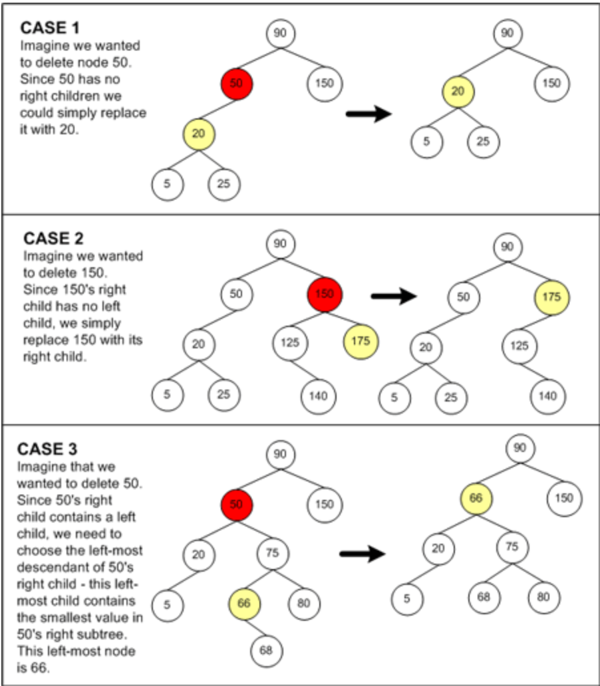
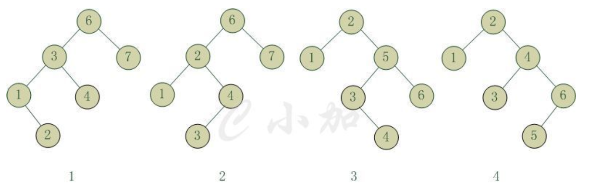
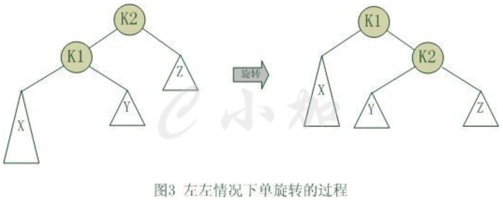
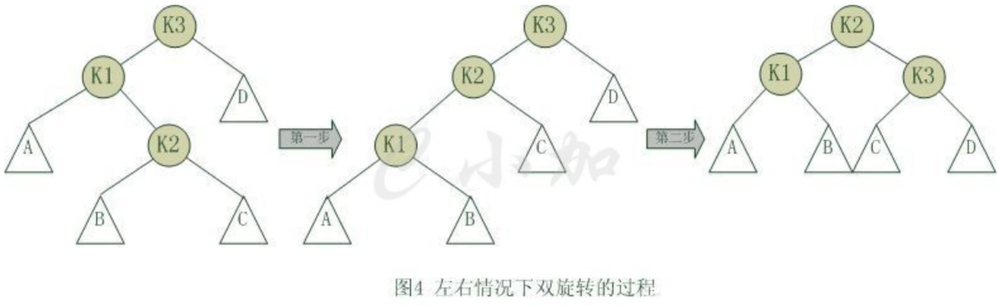

# 树
## 两种数据结构
* 线性结构：链表、栈、队列、string
* 非线性结构：树、图

## 二叉树的特点
* n个节点，n-1条边
* 第i层最多有2^i个节点
* 高为h的树，节点数最少h+1，最多2^(h-1)
* 叶子节点数为n0，度为2的节点数为n2，则：n0=n2+1
    * 证明：
    * 设度为1的节点数是n1，则：n=n0+n1+n2
    * n=B+1，B为分支数
    * 则：n0+n1+n2=1\*n1+2\*n2+1
    * 则：n0=n2+1
* n个元素的节点个数，最多：n-1，最少 「log2(n+1)」-1（上限）
```
class BianryNode {
      BinaryNode() {Left=Right=0;}
      BinaryNode(Object e) {element=e; Left=Right=0;}
      BinaryNode(Object e,  BinaryNode l, BinaryNode r) {element=e;  Left=l;  Right=r; }
      
       Object element;
       BinaryNode  left;    //left subtree
       binaryNode  right;   //right subtree
}

template<class T>class BinaryTree {
public:
         BinaryTree(){root=0;};
         ~BinaryTree(){};
         bool IsEmpty()const
             {return ((root)?false:true);}
         bool Root(T& x)const;
         void MakeTree(const T& data, BinaryTree<T>& leftch, BinaryTree<T>& rightch);
         void BreakTree(T& data , BinaryTree<T>& leftch, BinaryTree<T>& rightch);
         void PreOrder(void(*visit)(BinaryNode<T>*u)) {PreOrder(visit, root);}
         void InOrder(void(*visit)(BinaryNode<T>*u)) {InOrder(visit, root);}
         void PostOrder (void(*visit)(BinaryNode<T>*u)) {PostOrder(visit, root);}
         void LevelOrder (void(*visit)(BinaryNode<T> *u));
private:
         BinaryNode<T>* root;
         void PreOrder(void(*visit)(BinaryNode<T> *u), BinaryNode<T>*t);
         void InOrder(void(*visit)(BinaryNode<T> *u), BinaryNode<T>*t);
         void PostOrder(void(*visit) (BinaryNode<T> *u), BinaryNode<T>*t);
};
```

* PreOrder Traversal 前序遍历
```
template<class T>
void PreOrder(BinaryNode<T>* t) {
     // preorder traversal of *t.
     if(t) {
         visit(t);
         PreOrder(t->Left);
         PreOrder(t->Right);
     }
}
```

* InOrder Traversal 中序遍历
```
template<class T>
void InOrder(BinaryNode<T>* t) {
    if(t) {
        InOrder(t->Left);
        visit(t);
        InOrder(t->Right);
    }
}
```

* PostOrder Traversal 后序遍历
```
template<class T>
void PostOrder(BinaryNode<T>* t) {
    if(t){
           PostOrder(t->Left);
           PostOrder(t->Right);
           visit(t);
    }
}
```

## Binary Search Trees
### 插入过程
1. 若当前的二叉查找树为空，则插入的元素为根节点
2. 若插入的元素值小于根节点值，则将元素插入到左子树中
3. 若插入的元素值不小于根节点值，则将元素插入到右子树中
```
private BinaryNode insert( Comparable x, BinaryNode t ) {
    if( t == null )
        t = new BinaryNode( x, null, null );
    else if( x.compareTo( t.element ) < 0 )
        t.left = insert( x, t.left );
    else if( x.compareTo( t.element ) > 0 )
        t.right = insert( x, t.right );
    else
        ;   //duplicate; do nothing
    return t;
}
```

### 删除过程
1. p为叶子节点，直接删除该节点，再修改其父节点的指针
2. p为单支节点（即只有左子树或右子树）。让p的子树与p的父亲节点相连，删除p即可（注意分是根节点和不是根节点）
3. p的左子树和右子树均不空。就需要用被删除节点右孩子的左子树中的最下面的节点来替换它，就是说，我们用被删除节点的右子树中最小值的节点来替换。



二叉搜索树的中序遍历就是树的排序结果，删除过程就是将删除节点的后续一位前移

## AVL 平衡的二叉搜索树（Balanced Binary Tree）
* 是二叉搜索树
* 满足$\vert{h_L-h_R}\vert\leq1$，$h_L$为左子树高度，$h_R$为右子树高度

### 插入
对于一个平衡的节点，由于任意节点最多有两个儿子，因此高度不平衡时，此节点的两颗子树的高度差2.容易看出，这种不平衡出现在下面四种情况：



1. 6节点的左子树3节点高度比右子树7节点大2，左子树3节点的左子树1节点高度大于右子树4节点，这种情况成为左左。
2. 6节点的左子树2节点高度比右子树7节点大2，左子树2节点的左子树1节点高度小于右子树4节点，这种情况成为左右。
3. 2节点的左子树1节点高度比右子树5节点小2，右子树5节点的左子树3节点高度大于右子树6节点，这种情况成为右左。
4. 2节点的左子树1节点高度比右子树4节点小2，右子树4节点的左子树3节点高度小于右子树6节点，这种情况成为右右。

为此，通过旋转操作来使得树重新平衡
#### 单旋
单旋转是针对于左左和右右这两种情况的解决方案，这两种情况是对称的,为使树恢复平衡，我们把k2变成这棵树的根节点，因为k2大于k1，把k2置于k1的右子树上，而原本在k1右子树的Y大于k1，小于k2，就把Y置于k2的左子树上，这样既满足了二叉查找树的性质，又满足了平衡二叉树的性质。

#### 双旋
对于左右和右左这两种情况，单旋转不能使它达到一个平衡状态，要经过两次旋转。为使树恢复平衡，我们需要进行两步，第一步，把k1作为根，进行一次右右旋转，旋转之后就变成了左左情况，所以第二步再进行一次左左旋转，最后得到了一棵以k2为根的平衡二叉树。


## 黑红树 平衡的二叉搜索树（Balanced Binary Tree）
* 性质1. 节点是红色或黑色。
* 性质2. 根是黑色。
* 性质3. 所有叶子都是黑色（叶子是NIL节点）。
* 性质4. 每个红色节点必须有两个黑色的子节点。(从每个叶子到根的所有路径上不能有两个连续的红色节点。)
* 性质5. 从任一节点到其每个叶子的所有简单路径都包含相同数目的黑色节点。

### 插入
* 情形1: 该树为空树，直接插入根结点的位置，违反性质1，把节点颜色有红改为黑即可。
* 情形2: 插入节点N的父节点P为黑色，不违反任何性质，无需做任何修改。在这种情形下，树仍是有效的。性质5也未受到威胁，尽管新节点N有两个黑色叶子子节点；但由于新节点N是红色，通过它的每个子节点的路径就都有同通过它所取代的黑色的叶子的路径同样数目的黑色节点，所以依然满足这个性质。
**注：情形1很简单，情形2中P为黑色，一切安然无事，但P为红就不一样了，下边是P为红的各种情况，也是真正难懂的地方。**
* 情形3: 如果父节点P和叔父节点U二者都是红色，（此时新插入节点N做为P的左子节点或右子节点都属于情形3）则我们可以将它们两个重绘为黑色并重绘祖父节点G为红色（用来保持性质4）。现在我们的新节点N有了一个黑色的父节点P。因为通过父节点P或叔父节点U的任何路径都必定通过祖父节点G，在这些路径上的黑节点数目没有改变。但是，红色的祖父节点G的父节点也有可能是红色的，这就违反了性质4。为了解决这个问题，我们在祖父节点G上递归地进行上述情形的整个过程（把G当成是新加入的节点进行各种情形的检查）。
    * G为根节点，那我们就直接将G变为黑色（情形1）
    * 如果G不是根节点，而它的父节点为黑色，那符合所有的性质，直接插入即可
    * 如果G不是根节点，而它的父节点为红色，则递归上述过程。


* 情形4: 父节点P是红色而叔父节点U是黑色或缺少，新节点N是其父节点的左子节点，而父节点P又是其父节点G的左子节点。在这种情形下，我们进行针对祖父节点G的一次右旋转; 在旋转产生的树中，以前的父节点P现在是新节点N和以前的祖父节点G的父节点。我们知道以前的祖父节点G是黑色，否则父节点P就不可能是红色(如果P和G都是红色就违反了性质4，所以G必须是黑色)。我们切换以前的父节点P和祖父节点G的颜色，结果的树满足性质4。性质5也仍然保持满足，因为通过这三个节点中任何一个的所有路径以前都通过祖父节点G，现在它们都通过以前的父节点P。在各自的情形下，这都是三个节点中唯一的黑色节点。


* 情形5: 父节点P是红色而叔父节点U是黑色或缺少，并且新节点N是其父节点P的右子节点而父节点P又是其父节点的左子节点。在这种情形下，我们进行一次左旋转调换新节点和其父节点的角色; 接着，我们按情形4处理以前的父节点P以解决仍然失效的性质4。注意这个改变会导致某些路径通过它们以前不通过的新节点N（比如图中1号叶子节点）或不通过节点P（比如图中3号叶子节点），但由于这两个节点都是红色的，所以性质5仍有效。


## B tree 平衡的m叉搜索树
* 是扩充树
* 每个节点可包含多个（1->m-1个）键值
* 性质
    * 根节点至少2个子女
    * 除根节点外，其他所有内部节点，至少「m/2」（上限）个子女，最多m个子女
    * 所有外部节点都在同一层
    * 外部节点个数=键值总数+1
* 数据库索引结构，一般为B树或者B+树

## B+ tree
* 是B tree的一种变形，前4点同B tree，后2点不同
    1. 树中每个非叶节点最多有m棵子树
    2. 根节点（非叶节点）至少有2棵子树
    3. 除根节点外，每个非叶节点至少「m/2」（上限）棵子树
    4. 所有叶节点都处于同一层次
    5. 每个叶节点中，子树棵数n可以>m，也可以<m
    6. 根节点本身又是叶节点，则节点格式同叶节点
* 特点：关键码只分布在叶节点上

[返回目录](../CONTENTS.md)