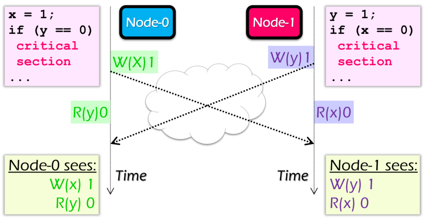
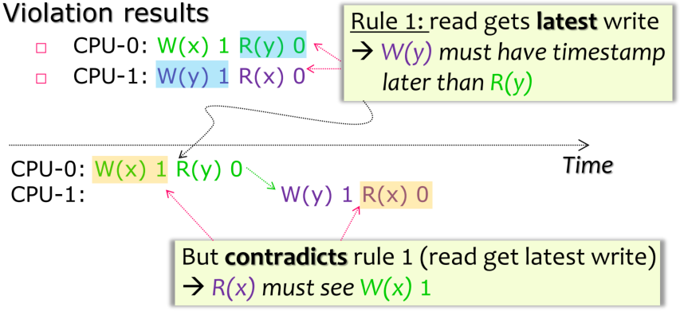
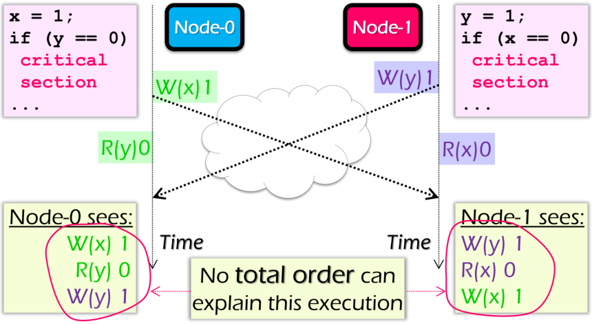
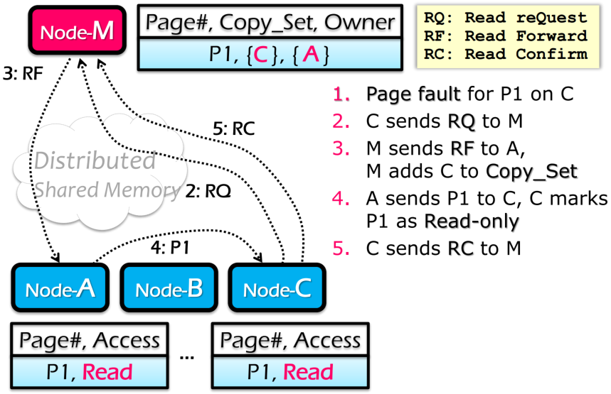
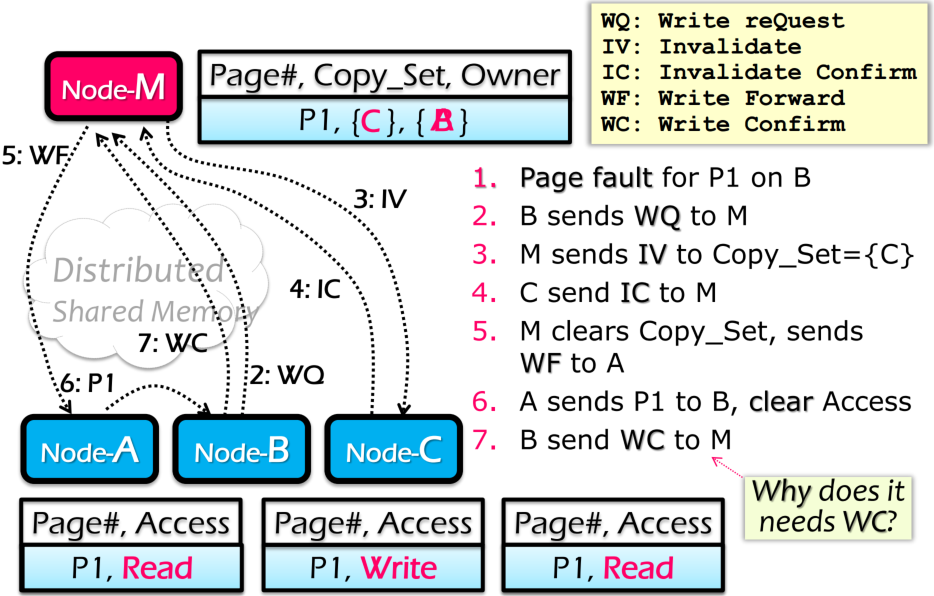

# Sequential Consistency
> 不考虑一致性的情况下，程序会出现错误（程序都进入到critical section中）

## 严格一致性 Strict Consistency
在严格一致性下，会存在一个**global wall-lock time**
* rule 1：每一个read的值都是最新write的值
* rule 2：在同一个CPU上的操作都拥有一个执行顺序的时间戳

程序不会出现错误，否则会违反rule 1

### 优点
绝对保证一致性

### 缺点
不存在**global wall-lock**，很难实现严格一致性

## 顺序一致性 Sequential Consistency
* rule 1：每个CPU的操作是顺序进行的
* rule 2：所有CPU的操作的最终结果与所有操作串行执行结果一致

程序同样不会出现错误，否则违反rule 2

### 优点
* 保证一致性
* 实现简单

### 缺点
* 所有顺序一致性的实现都必须有一个全局控制机制
* 任何一个读写操作都需要内存的同步操作

## Shared Virtual Memory: IVY
### IVY约束
* 每一个page只有一个owner
* owner拥有对应page的备份
* 如果owner给与page读/写权限，其他节点不可以拥有page的备份
* 如果owner给与page只读权限，该page的其他备份也只能只读
* Manager拥有所有备份的信息
### 通过Centralized Manager管理节点

### 读操作

### 写操作

[返回目录](../CONTENTS.md)