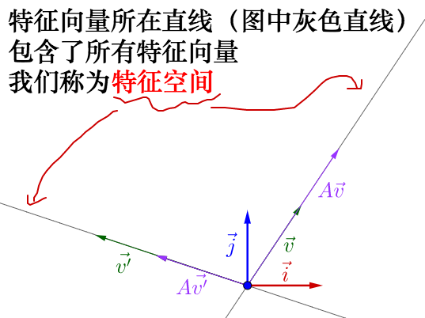
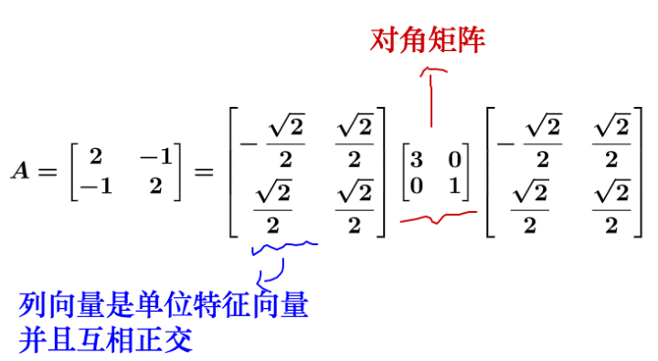

# 线性代数基础
## 标量、向量、矩阵、张量
* 标量：单个数组，计算的最小单元
* 向量：多个标量构成的一维数组
* 矩阵：标量构成的二维数组
* 张量：高于二维的数组

## 矩阵等价：
* 矩阵A经过有限次初等变换变为矩阵B，则A等价于B，记为A ~ B
* 自反性：A ~ A
* 对称性：A ~ B，则B ~ A
* 传递性：A ~ B，B ~ C，则A ~ C

## 线性空间&向量空间
### 线性组合
给定m维向量组A：$a_1,a_2,...,a_n$，对于任意实数$k_1,k_2,...,k_n$，对于任意m维向量b，如存在
$$b=k_1a_1 + k_2a_2 + ... + k_na_n$$
称向量b可以被向量组$a_1,a_2,...,a_n$线性表示

### 线性相关
给定向量组A：$a_1,a_2,...,a_n$，如果存在不全为0的实数 $k_1,k_2,...,k_n$，使得
$$0=k_1a_1 + k_2a_2 + ... + k_na_n$$
成立，则称向量组是线性相关的，否则是线性无关的

## 向量组的秩
给定向量组A：$a_1,a_2,...,a_n$，如果能从中选出r个子向量构成的子向量组$a_1,a_2,...,a_r, r < n$，满足：
* $a_1,a_2,...,a_r$线性无关
* 这r个向量组与向量组中其他任意一个向量组成的任意r+1个向量间是线性有关的

称$a_1,a_2,...,a_r$是向量组的一个最大无关向量组，最大无关向量组包含的向量个数r称为A的秩，由于列秩和行秩是相等的，故统称为矩阵的秩

## 范数

### 向量范数
将向量v映射到实数空间R的函数，只要满足以下三个条件即可称为范数

* 非负性：$f(x)\leq0$，当$f(x)=0$时，$x=0$
* 三角不等性：${f(x+y)}\leq{f(x)+f(y)}$
* 齐次性：任意n维向量x，$f(ax)=\vert{a}\vert * f(x)$

常用的是p范数：
$$\Vert{x_p}\Vert=\sqrt[p]{(\sum\vert{x_i}\vert^p)}$$
0范数：表示向量中非零元素的个数  
1范数：每个元素的绝对值之和  
$\infty$范数：最大范数，表示每个元素的绝对值的最大值

### 矩阵范数
将矩阵A映射到实数空间R的函数，只要满足以下四个条件即可
* 非负性：$f(A)\geq0$，当$f(A)=0$时，$A=0$
* 齐次性：任意n阶方阵A，$f(aA)=\vert{a}\vert * f(A)$
* 三角不等性：${f(A+B)}\leq{f(A)+f(B)}$
* 矩阵乘法的相容性：对于任意可乘矩阵A和B，满足${f(AB)}\leq{f(A)*f(B)}$

矩阵的范数定义：$\Vert{x}\Vert_p$是向量p范数，则
$$\Vert{A_p}\Vert=\max_{x\not=0} {\frac{\Vert{Ax}\Vert_p}{\Vert{x}\Vert_p}}=\max_{\Vert{x}\Vert_p=1} {\Vert{Ax}\Vert_p}$$

Frobenious范数定义为根号下矩阵各元素的平方和

## 特殊矩阵与向量
* 对角矩阵：除对角线外其余元素均为0，对于n阶方阵，可以记为$diag(v)=diag([v_1,v_2,...,v_n]^T)$
* 对称矩阵：如果$A=A'$，A为对称矩阵
* 单位向量：如向量的欧几里得（2范数）为1，则称其为单位向量
* 正交向量：$vx=0$，v与x的点积
* 正交矩阵：行向量正交，且为单位向量，也就是说$AA'=A'A=I$

## 特征值分解

特征值与特征向量：A为n阶方阵，如果存在实数λ和n维非零向量x，使得
$$Ax=λx$$

将λ称为A的特征值，x称为A对应于λ的特征向量

在同一特征空间下的特征向量是线性相关的，将n个线性无关的向量（如果有的话）组成一个方阵V，对应的特征值λ构成一个对角阵$\sum=diag(λ_1,λ_2,...,λ_n)$，那么
$$A=V\Sigma V^{T}$$

## 奇异值分解（SVD）
* 可以针对任意大小矩阵进行分解，A为m*n阶矩阵
* U为m阶方阵，$U={u_1,u_2,...,u_m}$，其中$u_i$是$AA^T$的第i大特征值对应的特征向量
* $\Sigma$为阶m*n对角阵，是$A^TA$第i大特征值的平方根
* V为n阶方阵，$V={v_1,v_2,...,v_n}$，其中$v_i$是$A^TA$的第i大特征值对应的特征向量
$$A=U\Sigma V^T$$

>大部分情况下，不需要完全还原矩阵A，只需要接近A就行，很多情况下，前10%甚至1%的奇异值的和就占了奇异值和的99%，故可以只选择前r大的奇异值来近似表示矩阵即可
>* ${U}\in{R_{m*r}}$
>* ${\Sigma}\in{R_{r*r}}$
>* ${V}\in{R_{r*n}}$
>$${A}\approx{U\Sigma V^T}$$

## 迹运算
将n阶方阵主对角线的各个元素加和称为A的迹，记为$trA$
* A的迹与A的F范数有关：$\Vert{A}\Vert_F=\sqrt[2]{tr(AA^T)}$
* 设$λ_1,λ_2,...,λ_n$为A的所有特征值：$trA=\sum_{i}{A_{i,i}}=\sum{λ_i}$
* 对矩阵的迹运算求导具有重要的性质

