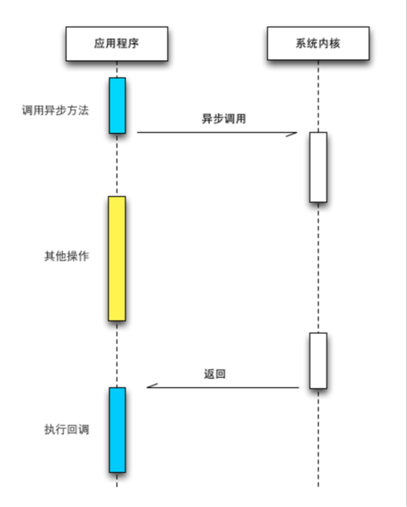

# Nodejs的特点
## 异步I/O
* IO对于操作系统内核而言，只有阻塞与非阻塞两种方式。阻塞模式的I/O会造成应用程序等待，直到I/O完成。同时操作系统也支持将I/O操作设置为非阻塞模式，这时应用程序的调用将可能在没有拿到真正数据时就立即返回了，为此应用程序需要多次调用才能确认I/O操作完全完成。这种重复调用判断操作是否完成的技术叫做“轮询”
* I/O的同步与异步：I/O的同步与异步出现在应用程序中。如果做阻塞I/O调用，应用程序等待调用的完成的过程就是一种同步状况。相反，I/O为非阻塞模式时，应用程序则是异步的



## 事件与回调函数
* 函数作为参数传递到另一个函数中，然后被调用。
```
var fs=require('fs'); //请求调用fs（filesystem）模块，在脚本使用
//前两个参数分别为路径和文件编码，第三个参数为回调函数
fs.readFile('filename.txt', 'utf8', function(err,data) {  
     if (err) throw err; //如果读取文件有误，抛出错误
     console.log(data); //否则，来自文件的数据会显示在控制台上
});
```

## 单线程
* 优点
    * 不需要注意同步问题
    * 不存在死锁
    * 没有线程交换所带来的性能上的开销

* 缺点
    * 无法利用多核CPU
    * 错误会引起整个程序的退出
    * 大量计算占用CPU导致无法继续调用异步I/O

## 跨平台
	* Linux
	* Windows

[返回目录](../CONTENTS.md)