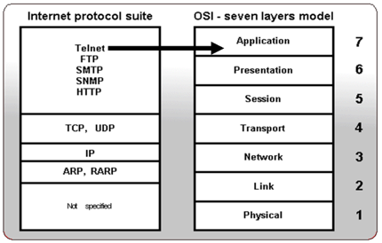
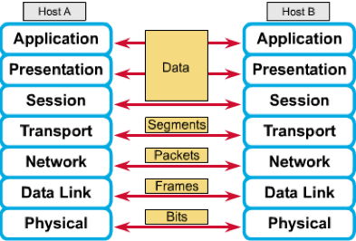
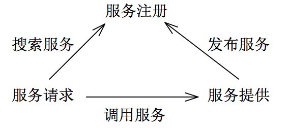

# 国泰君安
1. 排序的顺序与初始顺序无关的排序算法举例：堆排序
2. 对称加密与不对称加密，分别举例：
* 对称加密：加密和解密使用相同密钥，举例：DES（数据加密标准）、IDEA（国际数据加密算法）
* 不对称加密：采用公钥和私钥，公钥加密使用私钥才能解，私钥加密使用公钥才能解，举例：RSA、DSA（数字签名用）
3. Cookie与Session的不同点
* Session存放在服务器端，而Cookie存放在客户端
* Session实现的两种机制：Cookie机制和URL重写
* Cookie有两种类型：有生命周期和无生命周期
* Session运行依赖Session ID，Session ID可以存在于Cookie中
* 用户验证一般会用Session
4. 层次遍历使用的数据结构：队列，因为先进先出
5. OSI七层模型及其简介
* 七层模型：
    * 物理层：二进制传输，信号，介质
    * 数据链路层：帧，媒介访问控制
    * 网络层：寻址和最优路径选择
    * 传输层：终端对终端的连接
    * 会话层：会话，管理表示层实体之间的数据转换
    * 表示层：数据的显示和加密
    * 应用层：用户界面
* 各层协议

* 各层传输数据类型

* TCP：3次握手建立连接，4次挥手释放连接
6. 简述WebService优缺点
* WebService：平台独立、低耦合、自包含、基于可编程的Web应用程序，使得不同机器上的不同应用之间可以交流
* 适用于：1）跨越防火墙；2）应用程序集成；3）B2B（business to business）集成；4）软件重用；
* 不适于：1）单机应用程序；2）局域网上的同构应用程序；
7. SOA架构

* 搜索服务：UDDI（统一描述、发现与集成）
* 调用服务：SOAP（1.0简单对象访问协议）
* 发布服务：WSDL（WebService定义/描述语言）

[返回目录](../CONTENTS.md)