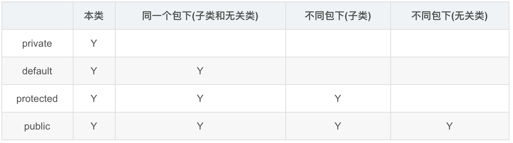

# 百度

## 笔试
1. java四种权限修饰符

2. 地址范围
* A类地址范围：0.0.0.0～127.255.255.255
* B类地址范围：128.0.0.0～191.255.255.255
* C类地址范围：192.0.0.0～223.255.255.255
* D类地址范围：224.0.0.0～239.255.255.255
* E类地址范围：240.0.0.1～255.255.255.254
