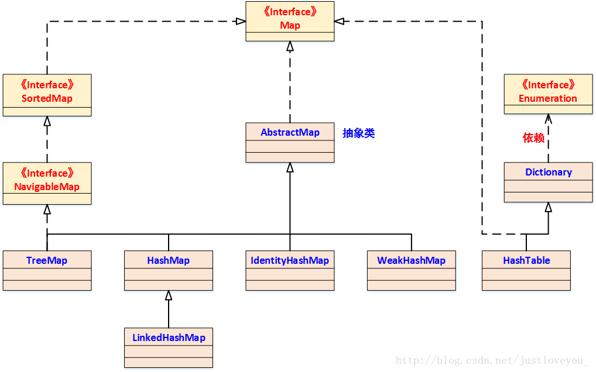

# 摩根斯坦利

1. TCP、UDP
* TCP传输控制协议（Transmission Control Protocol）：面向连接（Connection Oriented）、可靠（reliable）、点对点、全双工（full duplex）、面向字节流（Byte Stream），有滑动窗口（Sliding window），握手（shake hand），挥手（wave hand）
* UDP用户数据报协议：无连接（Connectionless）、不可靠（unreliable）、面向报文的（Datagram Oriented）、支持一对一一对多多对多通信

2. Stack/Queue
* Stack：LIFO, push, pop, peek
* Queue：FIFO, 使用offer和poll优于add和remove之处在于它们返回值可以判断成功与否，不抛出异常

3. QuickSort
* Time Complexity: O(n*logn)

4. BST
* Binary Search Tree二叉树
* 空树，有左子树（left subtree）和右子树（right subtree）

5. Design Pattern
* 单例：Singleton
* 观察者：Observer
* 代理：Proxy
* 适配器：Adapter
* 工厂：Factory（创建对象）
* 策略：Strategy

6. Compiled and Interpreted Language
* 编译型语言：C、C++等，运行时将程序翻译成机器语言
* 解释型语言：Java、Python等，将编译和解释合二为一，编译器将高级语言翻译成中间代码（intermediate code），解释器解释成机器码

7. Memory Leak
* 申请了内存但未释放
* java中报OutOfMemoryError
* GC不完全，引用计数器算法（Reference Counter Algorithm）检测对象，相互引用

8. Constructor & Destructor
* 构造函数创建对象调用，无返回类型
* 析构函数，删除对象时执行，无返回值无参数，主要：释放资源

9. Object和String类的方法
* Object: toString、equals、notify、notifyAll、wait、clone、hashCode、getClass、finalize
* String: charAt、compareTo、concat、endsWith、indexOf、length、replace、split、subString、toCharArray、trim

10. 等价类（Equivalence Class）
* 自反性(reflexivity)、对称性（symmetry）、传递性(transitivity)

11. Java重写(override）和重载（overload）
* 重写：子类继承父类，重写方法
* 重载：一个类中，方法名相同，参数不同

12. 进程与线程的区别
* 进程：资源分配与保护的基本单位 allocate and protect system resources；
* 线程：系统调度和分派的基本单位 schedule and dispatch system；

13. 类和对象
* 对象是类的实例，类是对象的模板，对象在堆中，类在方法区

14. 非聚集索引 Non-clustered Index

15. 范式 Paradigm

16. 死锁 Deadlock
* 产生的条件
    * 互斥条件
    * 请求和保持条件
    * 不可抢占条件
    * 循环等待条件
* 避免死锁
    * 银行家算法(Banker's Algorithm)
        * 当满足：1)request<=max; 2)request<=avaliable，资源才会被分配

17. HashMap是无序的，要实现有序怎么办
* LinkedHashMap（维护额外的双向链表保证迭代的顺序）
* TreeMap

18. 问题：
* What will the interns do in the internship?
* Is there any chance for an intern to become a formal employee if he interns In Morgan in summer vacation?

[返回目录](../../CONTENTS.md)