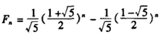

# 腾讯
1. 私网地址：
* 10.0.0.0～10.255.255.255
* 172.16.0.0～172.31.255.255
* 192.168.0.0～192.168.255.255
2. 函数指针
* 指向函数的指针
3. 折半查找
```
public static int sort(int[] array,int a,int lo,int hi){
    if(lo<=hi){
        int mid=(lo+hi)/2;
        if(a==array[mid]){
            return mid+1;
        }
        else if(a>array[mid]){
            return sort(array,a,mid+1,hi);
        }else{
            return sort(array,a,lo,mid-1);
        }
    }
    return -1;
}
```
* 要求：array有序
* 复杂度：$O(\log_{2}n)$
4. 斐波拉契通项公式

5. Set和Vector的使用
* 参考[Collection集合类](../../java/java_basics/collection.md)

[返回目录](../CONTENTS.md)
